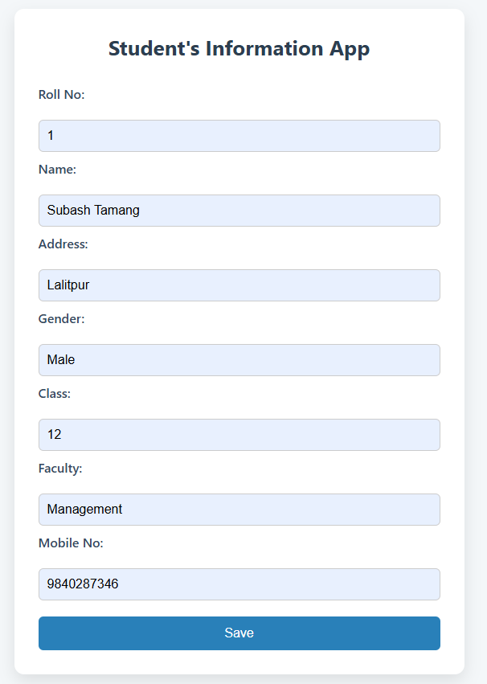
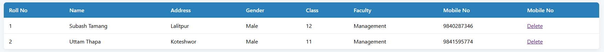
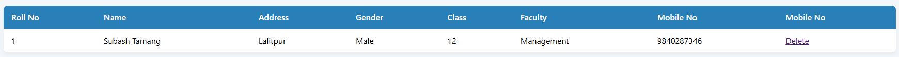

# 🎓 Student Information App

This is a simple web application built with PHP and MySQL to manage student information. You can add, view, and delete student records using a user-friendly interface.
> ✅ Ideal for beginners who want hands-on experience building real-world PHP/MySQL projects.

---

## 🚀 Features

- ➕ Add new student records (Roll No, Name, Address, Gender, Class, Faculty, Mobile No)
- 📄 View all student records in a table
- ❌ Delete student records
- 💾 All data stored in a MySQL database
- 🎨 Simple and clean interface using HTML & CSS
- 🔗 Easily customizable and extendable for further learning

---

## 📚 What You'll Learn
By building and running this project, you’ll gain experience with:
- How to use PHP to interact with MySQL
- Writing SQL queries for data insertion, retrieval, and deletion
- Creating and handling HTML forms
- Using GET and POST methods
- Organizing a small PHP project
- Understanding how CRUD operations work in web apps

---

## 🧰 Technologies Used
- Frontend: HTML, CSS
- Backend: PHP
- Database: MySQL
- Local Server: XAMPP (Apache + MySQL)

---

## 📦 Prerequisites

Before running this app, make sure you have the following installed:
- ✅ [XAMPP](https://www.apachefriends.org/) or any local server with PHP and MySQL
- ✅ A web browser (like Chrome, Firefox, Edge)
- ✅ Basic knowledge of how to run PHP files on localhost

---

## ⚙️ Setup Instructions

### 1️⃣ Start XAMPP

- Open **XAMPP Control Panel**.
- Start both **Apache** and **MySQL** modules.

### 2️⃣ Create the Database

1. Open your browser and go to [http://localhost/phpmyadmin](http://localhost/phpmyadmin).
2. Click **New** in the sidebar to create a new database.
3. Enter `student` as the database name and click **Create**.
4. Inside the `student` database, go to the **SQL** tab and paste the following code:

    ```sql
    CREATE TABLE info (
        Roll INT PRIMARY KEY,
        Name VARCHAR(100),
        Address VARCHAR(255),
        Gender VARCHAR(10),
        Class VARCHAR(50),
        Faculty VARCHAR(100),
        Mobile VARCHAR(10)
    );
    ```
5. Click **Go** to execute the SQL query.

---

### 3️⃣ Copy Project Files

- Download or clone this project.
- Copy the entire `Student Information App` folder to `C:\xampp\htdocs\`

### 4️⃣ Project File Structure

```
Student Information App/
│
├── assets            # Screnshot photos
│   ├── After_delete.png
│   ├── Form.png
│   └── List_student.png
├── index.php         # Main page with form to add student
├── add_data.php      # Handles form submission and inserts data
├── data.php          # Displays all student records
├── delete.php        # Deletes a student record
├── db.php            # Database connection file
├── styles.css        # CSS styles
└── readme.md         # Documentation (This file)
```

---

## 🧑‍🏫 How to Use

### ➕ Add a New Student

1. **Open your browser** and go to:  
   [http://localhost/Student%20Information%20App/index.php](http://localhost/Student%20Information%20App/index.php)

2. **Add a Student:**  
   - Fill in the form:
        - **Roll No** (must be unique)
        - **Name**
        - **Address**
        - **Gender** (e.g., Male/Female/Other)
        - **Class**
        - **Faculty**
        - **Mobile Number**

3. **Save Data:**
    - Click **Save**. If successful, you’ll be redirected or shown a success message.

### 📄 View All Students
- **Open your browser** and go to or visit:
     [http://localhost/Student%20Information%20App/data.php](http://localhost/Student%20Information%20App/data.php)
     - You'll see a table with all student records will be displayed.

### ❌ Delete a Student Record
   - Each record in the table will have a **Delete** link.
   - Click the link to delete that specific student.

---

## 🛠️ How the Code Works

### 🔗 `db.php` – Database Connection
Connects your PHP code to the MySQL database using `mysqli_connect()`. It’s included in all files that interact with the database.

### 🧾 `index.php` – Add Form
An HTML form that collects student data. It uses the `POST` method to send data to `add_data.php`.

### 📥 `add_data.php` – Insert Data
Receives data from the form and inserts it into the database using SQL `INSERT`.

### 📋 `data.php` – Display Records
Fetches data from the database using SQL `SELECT` and shows it in a table.

### 🗑️ `delete.php` – Delete Records
Deletes a student by their Roll No using SQL `DELETE`.

---

## 🧪 Troubleshooting
- ❗ If your PHP files don't run, make sure:
    - Apache and MySQL are running
    - Files are placed in the correct htdocs folder
    - You're accessing the correct URL in your browser

- ❗ If the database connection fails:
    - Check your credentials in db.php
    - Make sure the database name is correct
    - Ensure the database is accessible from your PHP script
    
---

## 🧠 Ideas to Expand This Project
Want to practice more? Try adding these features:
- ✏️ Update/Edit student records
- 🔍 Search functionality (by name, class, etc.)
- 🧾 Pagination for the student list
- 📥 Export records to CSV or PDF
- 🔒 Login system to restrict access
- ✅ Form validation (required fields, phone number format)
- 🛡️ Use Prepared Statements to prevent SQL Injection

---

## 📝 Notes

- Make sure your database credentials in `db.php` match your MySQL setup.
- This app does not include advanced validation or security (for learning purposes only).
- For any issues, restart Apache and MySQL from XAMPP.

---

## 📸 Screenshots

> 💡 Add screenshots to make your project visually appealing:
- **Add Form (index.php)**
  


- **Student List (data.php)**
  


- **After Delete Action**
  


---

## 🙏 Credits

This app was created as a **learning project** to help beginners understand how PHP and MySQL work together in a web application.

---

## 🛡️ Disclaimer
- This project is for educational purposes only.
- No user authentication, form validation, or SQL injection prevention is implemented.
- For production apps, use prepared statements and validation.

---

## ❓ Frequently Asked Questions (FAQ)

### Q: What is localhost?
**A:** It’s your local computer acting as a web server. Using tools like XAMPP, you can run PHP code as if it's hosted online.

### Q: Why is the database connection not working?
**A:** Check your MySQL credentials in db.php. For XAMPP:
- Username: root
- Password: (empty)

### Q: Can I use this project online?
**A:** Not directly. It's built for local use only. To make it secure and production-ready, you'd need:
- Server-side validation
- Prepared statements
- Authentication
- HTTPS setup
